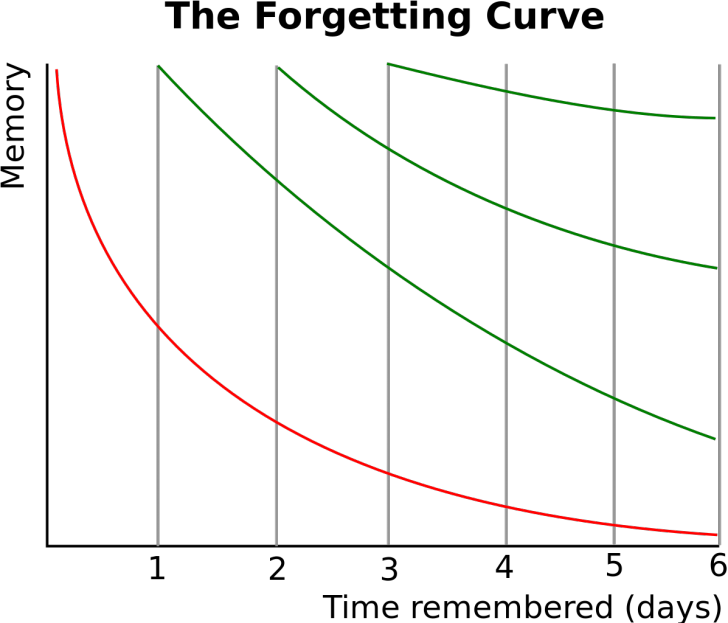

# Flashy
An application for memorization based on scientific finding, which increases memory strength in an efficient way, i.e. less efforts, more memorization.

## Introduction
Increasing memory strength can be optimized in an efficient way. Based on [Ebbinghaus Forgetting Curve](https://www.psychestudy.com/cognitive/memory/ebbinghaus-forgetting-curve), Ebbinghaus forgetting curve is exponential in nature.

Therefore, there's a way to utilize this characteristic and enhance human memory. This application is built to help user memorize anything they want.

## Requirement
* python 3

## Installation

## Usage
